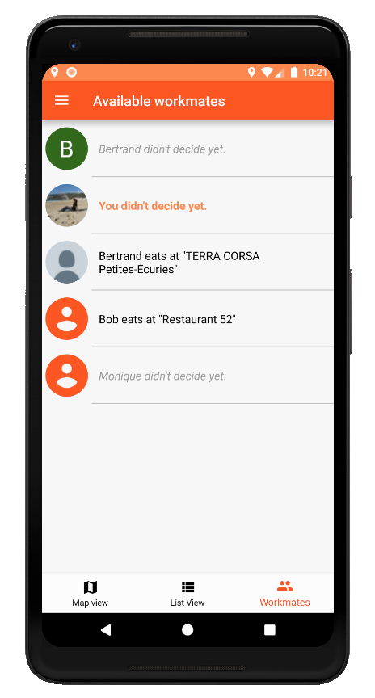

<h1>Go4Lunch</h1>
This app has been realized for a training purpose. 
Its goal is to allow you to tell your colleagues where you go to eat at noon. 

<h1>Screenshots</h1>

<h1>Motivation</h1>
This app was part of the mandatory app to realize to achieve the training. 
First app of the training.

<h1>Features</h1>
Allows to record loans and expected deliveries. 
- Map : check the restaurant around you on the map (and see if someone already planned to go there, green pin) 
- List : see a list of restaurant 
- Workmates : see the list of workmates and where they eat 
- Restaurant : you can click on a restaurant to see its detail (and set it as the place where you go to eat, or favorite) 
- Search : in map/list view, you can search restaurant using the search bar 
- Side menu : you can see your chosen place to eat, your notifications settings and logout

2 langages available : english/french

<h1>How to use the app ?</h1>

**Navigate among the different views** :
- click map / list or workmates to see the accurate view
- click the side menu to check your current chosen place
 

**Choose the place you want to eat**  :
- click on a pin (map), item (list) to open the detail view of a restaurant
- choose the restaurant checking the tick
- to recall what you chose, you can click the "your lunch" link on the side menu
 

<h1>Technical considerations</h1>
These libraries have been used to develop this app : 
Glide :         implementation 'com.github.bumptech.glide:glide:4.9.0'
                annotationProcessor 'com.github.bumptech.glide:compiler:4.9.0' 
Butterknife :         implementation 'com.jakewharton:butterknife:10.1.0'
                      annotationProcessor 'com.jakewharton:butterknife-compiler:10.1.0' 

Firebase has been used for authentication and Firebase Firestore to save/store data.

<h1>Credits</h1>
Bertrand Ripoche
